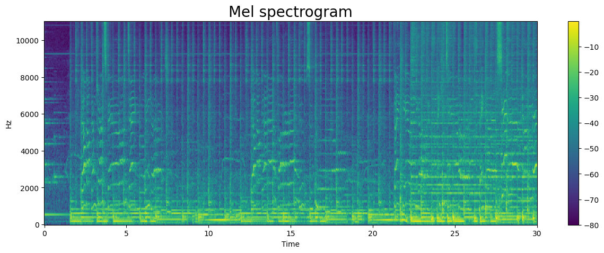
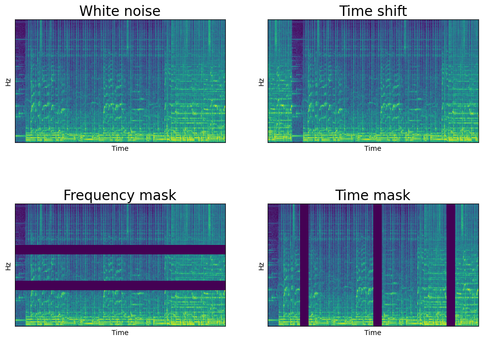
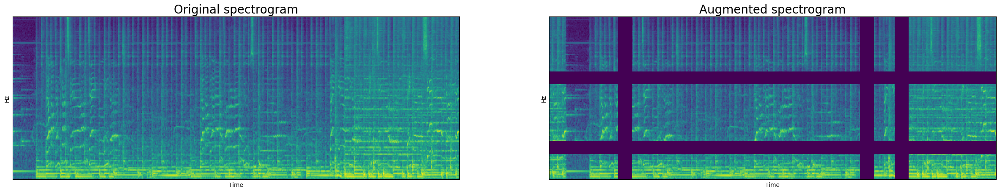
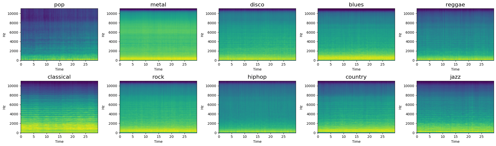
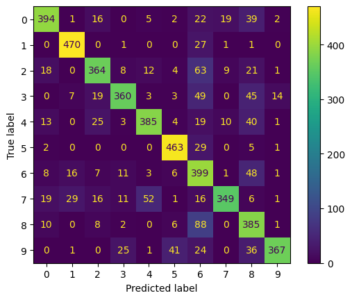
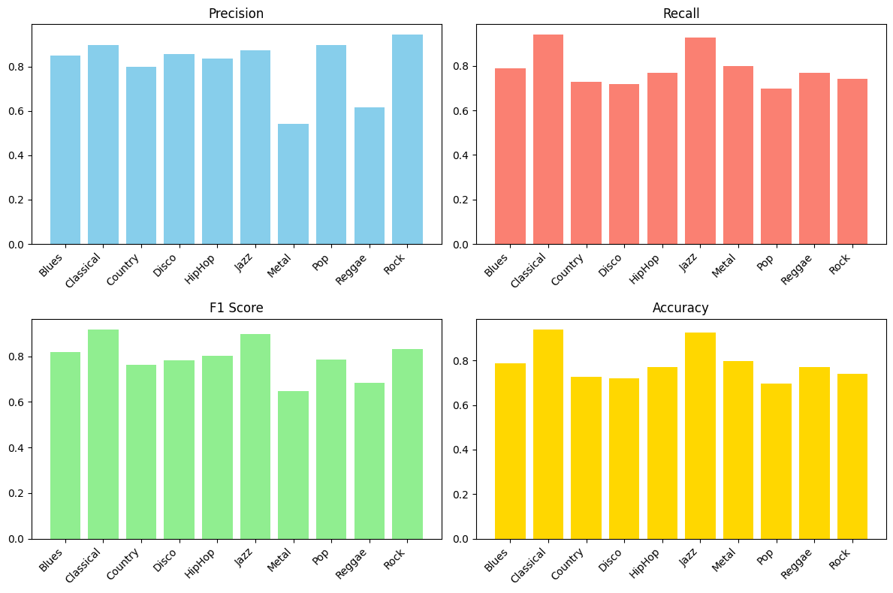

# Music_genre_classification  
University project consisting in reproducing the results of a paper.  
The paper presents a novel architecture based on CNN for music genre classification. More specifically, it consists of a unet followed by parallel convolutions.  

 # PROCEDURE
 ## Split audio
 All audio clips are split into 5 different clips. This method allows to have a bigger dataset without losing too much information. All clips belonging to the same song are all either in the training set or in the validation set. This step is crucial in order to maintain the independence between the two datasets.
 ## Conversion to spectrogram
 As is often the case when dealing with audios using a neural network, we convert them to spectrograms and treat them as images. This is because architectures designed for image processing are more advanced, since the interest is bigger in that field.
   
 
 ## Data augmentation
 Even though spectrograms are treated by neural networks as images, classical augmentation techniques designed for images like rotating or flipping are not effective on spectrograms. Instead, spectrogram augmentation techniques fall into two categories: those that work on the waveform (more powerful but computationally more demanding, as the spectrogram must be calculated for each sample at every epoch) and those that work on the spectrogram itself (less powerful but more efficient). In this project, we used the second approach because of computational constraints. 
   
       
    
   
   ## Genres
 The GTZAN includes 10 different music genres. Here are the mean spectrograms for each one.
   
 
 
 ## RESULTS
We achieved a total accuracy of 76% in the training set and 66.7% in the validation set with a model of 3.4M parameters (~13MBs)
  

  
The confusion matrix reveals that the model has troubles differentiating between metal, reggae, and country. Most of the error came from these 3 genres, while the confusion matrix  otherwise indicates strong performance. Looking at the mean spectrograms, these 3 genres have clear similarities. Instead, looking at jazz and classical, they have the most distinct spectrograms, with clear differences with respect to the others. This is confirmed by the fact that the model performs best for these 2 models in every metric.

